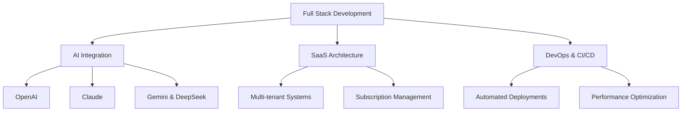

<div>
  
# 🚀 FULL STACK DEVELOPER | AI SPECIALIST


[](https://linkedin.com/in/yourprofile)
[](https://your-portfolio.com)
[](mailto:your.email@example.com)

</div>


## 👨‍💻 `whoami`

I transform complex business requirements into **elegant, scalable digital solutions**. With expertise in both **frontend and backend technologies**, I specialize in creating high-performance SaaS platforms and AI-powered applications that drive business growth.

```javascript
const developer = {
  specialization: ["Full Stack Development", "AI Integration", "SaaS Architecture"],
  revenue_generated: "$100K+",
  experience: "3+ years",
  passion: "Building tomorrow's solutions with today's code"
};
```

## 🛠️ Tech Arsenal

<table>
  <tr>
    <td valign="top" width="50%">
      <h3>Frontend</h3>
      <div>
        
        
        
        
        
      </div>
      <h3>Backend</h3>
      <div>
        
        
        
        
        
      </div>
    </td>
    <td valign="top" width="50%">
      <h3>AI & Mapping</h3>
      <div>
        
        
        
        
        
      </div>
      <h3>DevOps & Tools</h3>
      <div>
        
        
        
        
      </div>
    </td>
  </tr>
</table>

## 🔥 Featured Projects

<div align="center">

| Project | Tech Stack | Achievements |
|---------|-----------|--------------|
| **🚀 SaaS Revenue Platform** | React, Node.js, MongoDB | Generated $100K+ revenue, Reduced operational costs by 30% |
| **🤖 AI Business Assistant** | Claude API, OpenAI, Vue.js | Automated 75% of customer inquiries, 24/7 availability |
| **🌐 Geospatial Analytics** | Mapbox, React, WebSockets | Real-time location intelligence for 5000+ daily users |

</div>

## ⚡ Stats & Contributions

<div align="center">
  
  
</div>

## 💎 Core Expertise

<div align="center">


</div>

- **Performance Wizard**: Improved application speeds by 40%
- **Deployment Expert**: Reduced deployment times by 50%
- **Solutions Architect**: Designed systems handling 1M+ monthly requests

## 📫 Let's Build Something Amazing

<div align="center">
  
[](https://github.com/yourusername)
[](https://twitter.com/yourusername)

**"The best way to predict the future is to create it."**

</div>
